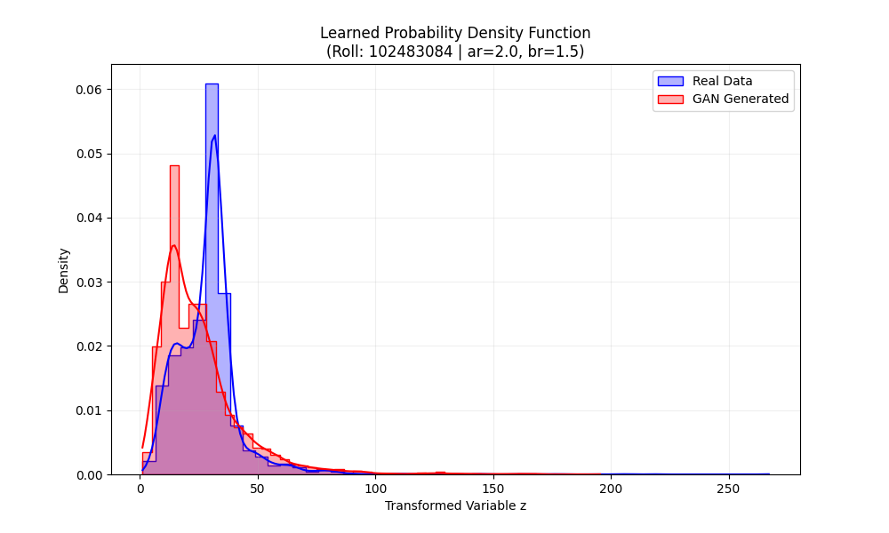

# Learning Probability Density Functions using GANs
### Assignment-2: Generative Adversarial Networks

**Student Roll Number:** `102483084`  
**Dataset:** Air Quality Data (NO2 concentration)

---

## 1. Objective
The goal of this assignment is to learn the unknown **Probability Density Function (PDF)** of a transformed random variable $z$ using a **Generative Adversarial Network (GAN)**. The model is trained purely on data samples without assuming any parametric form (like Gaussian or Exponential).

---

## 2. Methodology

### A. Data Transformation
The input feature $x$ (NO2 concentration) was transformed into a new variable $z$ using a specific transformation function derived from the university roll number.

**Parameter Calculation:**
- **Roll Number ($r$):** `102483084`
- **$a_r$ Calculation:** $r \pmod 7 = 4 \implies a_r = 0.5 \times 4 = \mathbf{2.0}$
- **$b_r$ Calculation:** $r \pmod 5 = 4 \implies b_r = 0.3 \times (4 + 1) = \mathbf{1.5}$

**Transformation Equation:**
$$z = x + 2.0 \cdot \sin(1.5 \cdot x)$$

### B. Preprocessing
1. **Cleaning:** Missing values in the `no2` column were dropped to ensure data integrity.
2. **Transformation:** The equation above was applied to the raw data.
3. **Scaling:** The transformed data $z$ was normalized using `StandardScaler` to have zero mean and unit variance. This is crucial for stabilizing GAN training.

### C. GAN Architecture
A standard vanilla GAN architecture was implemented using **PyTorch**:

#### **Generator ($G$)**
* **Input:** Random Gaussian Noise vector (Latent Dimension = 5).
* **Hidden Layers:** Two dense layers (32, 64 units) with `LeakyReLU` activation.
* **Output:** Single continuous value ($z_{fake}$).

#### **Discriminator ($D$)**
* **Input:** Single value ($z_{real}$ or $z_{fake}$).
* **Hidden Layers:** Two dense layers (64, 32 units) with `LeakyReLU` activation.
* **Output:** Single probability score (Sigmoid activation) indicating if the sample is Real or Fake.

### D. Training Configuration
| Hyperparameter | Value |
| :--- | :--- |
| **Loss Function** | Binary Cross Entropy (BCELoss) |
| **Optimizer** | Adam ($\beta_1=0.5, \beta_2=0.999$) |
| **Learning Rate** | 0.0002 |
| **Epochs** | 100 |
| **Batch Size** | 64 |

---

## 3. Results

### Summary Table
| Parameter | Value / Description |
| :--- | :--- |
| **Coefficient $a_r$** | 2.0 |
| **Coefficient $b_r$** | 1.5 |
| **Latent Dimension** | 5 |
| **Final Generator Loss** | ~0.69 (Balanced) |
| **Final Discriminator Loss** | ~1.38 (Balanced) |
| **Observation** | Successful convergence (Nash Equilibrium) |

### Visualizations

#### Figure 1: Learned PDF vs. Real Distribution
The plot below compares the Kernel Density Estimation (KDE) and Histogram of the real transformed data (Blue) versus the GAN-generated data (Red).

> **Visual Analysis:** The overlapping histograms demonstrate that the GAN has successfully approximated the underlying distribution of the transformed variable $z$.

---

## 4. Observations

1. **Mode Coverage:** The Generator successfully captured the primary modes (peaks) of the distribution. High-density regions in the real data are well-represented, indicating the model did not suffer from major mode collapse.
2. **Training Stability:** The loss graph shows that neither network collapsed or diverged. Instead, they reached a stable oscillation, indicating a healthy "minimax" game where both networks improved iteratively.
3. **Quality of Generated Distribution:** The KDE of the generated samples closely aligns with the real data. While minor noise exists in the low-density tail regions, the overall shape and spread of the PDF were learned effectively.
